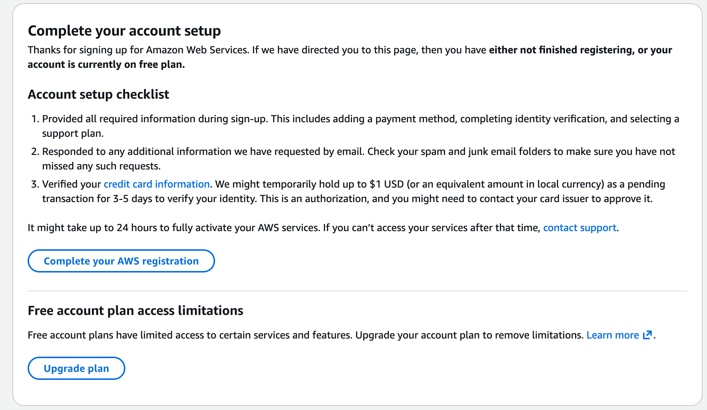

# Client Risk Assessment & Data Validation Tool

A web-based analytical tool designed to validate client datasets and assess risk levels using structured business rules.  
The project simulates a real-world analyst workflow where raw client data is cleaned, evaluated, and converted into actionable insights.

---

## 📌 Project Overview

In consulting and analytics engagements, decision-making depends heavily on the quality and reliability of client data.  
This project focuses on identifying data quality issues and classifying clients based on predefined risk criteria to support informed business decisions.

---

## 🎯 Objectives

- Validate incoming client data for completeness and correctness  
- Identify high-risk client records using rule-based logic  
- Categorize data into actionable risk segments  
- Demonstrate structured, analytical thinking aligned with consulting workflows  

---

## 🔍 Key Features

- Upload client data in CSV format  
- Validate critical fields and detect missing or invalid values  
- Flag high-risk and inconsistent records  
- Classify data into **Accept / Review / Reject** categories  
- Provide transparent and explainable risk logic  

---

## 🧠 Business Logic Used

**Data Validation**
- Missing or invalid values are flagged  
- Unrealistic or negative numerical values are marked invalid  

**Risk Assessment**
- High Risk → Critical issues or missing data  
- Medium Risk → Partial inconsistencies requiring review  
- Low Risk → Clean and reliable data  

**Decision Output**
- Accept → Ready for analysis  
- Review → Requires manual verification  
- Reject → Invalid or high-risk data  

---

## 📸 Screenshots

### Risk Assessment Output

---

## 🛠 Tools & Technologies

- HTML5  
- CSS3  
- JavaScript (Vanilla)  
- CSV for structured client data  
- GitHub Pages for deployment  

---

## 🚀 How to Run the Project

1. Clone or download the repository  
2. Open `index.html` in a modern browser  
3. Upload a CSV file containing client data  
4. View validation results and risk classification instantly  

---

## 💼 Use Case Relevance

This project reflects a core analyst responsibility:  
ensuring data quality and evaluating risk before insights are shared with business stakeholders or clients.

It aligns with entry-level analytics and consulting roles that require attention to detail, structured reasoning, and business-oriented problem solving.

---

## 👤 Author

Tanishq Sharma  
Fresher | Aspiring Analyst  

